# 7.用户管理与文件权限

##### 1.简单概念

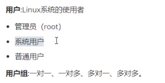

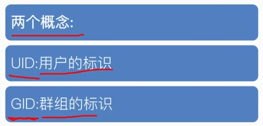

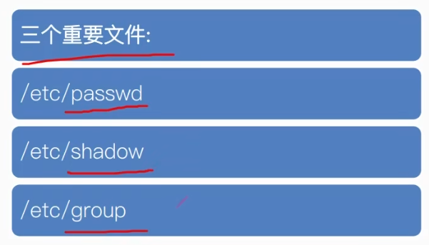


示例：
Linux登录时：

输入密码后点击登录，Linux去到passwd目录找到用户名对应的UID，然后去group文件找用户名对应的GID。若既能找到UID，又能找到GID，则说明该用户在Linux系统中是合法用户。则接下来会去shadow目录下找到用户名加密的密码，进行验证密码的步骤，成功则进入系统，失败则提示。


##### 2.三个核心文件

```
sudo gedit /etc/目录
//打开某一路径下的文件
```

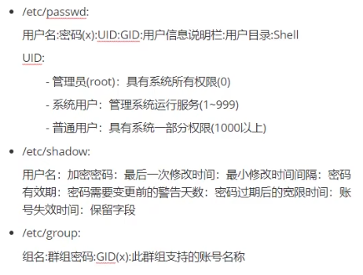


###### passwd：

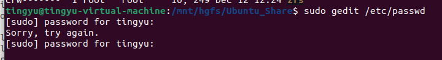

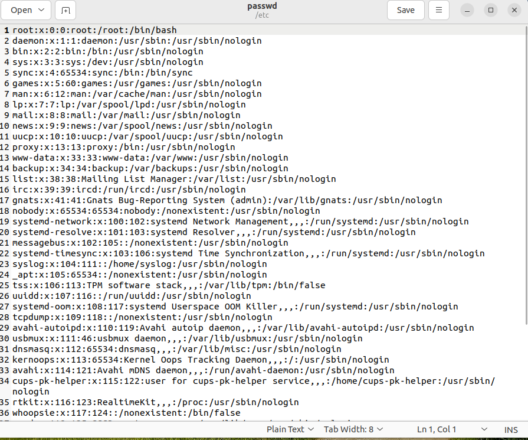

每一行就记录了一个用户的信息

上面那些没见过的都是系统用户。

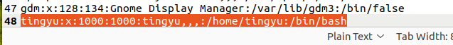

这是我们自己的用户：普通用户

tingyu:用户名

x:曾经用来保存密码的字段

1000：UID，若为0则为管理用户

1000：GID，若创建用户时没指定则会以UID来创建一个默认用户组ID

tingyu，，，：用户信息栏的说明栏，无太大意义

/home/tingyu/bin/bash：该用户的主目录，也是默认控制台的目录

```
pwd
//查看当前目录位置
```

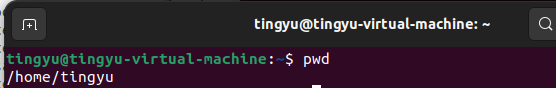

/bin/bash：bin目录下的bash程序，指定的脚本解析器。若改为/usr/sbin/nologin，则将会失去终端程序


###### shadow


tingyu:用户名

\$y\$j9T\$Rw1PtayKbMLKG2MvkHT3a0\$8vwVxkNBv/H5dfqv5BN8pYbzRiA1xPhcQ4BMTlGsAX.：加密密码的字符串

19872：加密密码最后一次修改时间（1970.1.1为起始到那天的总天数）

0：最小修改密码时间间隔

后面：略


###### group

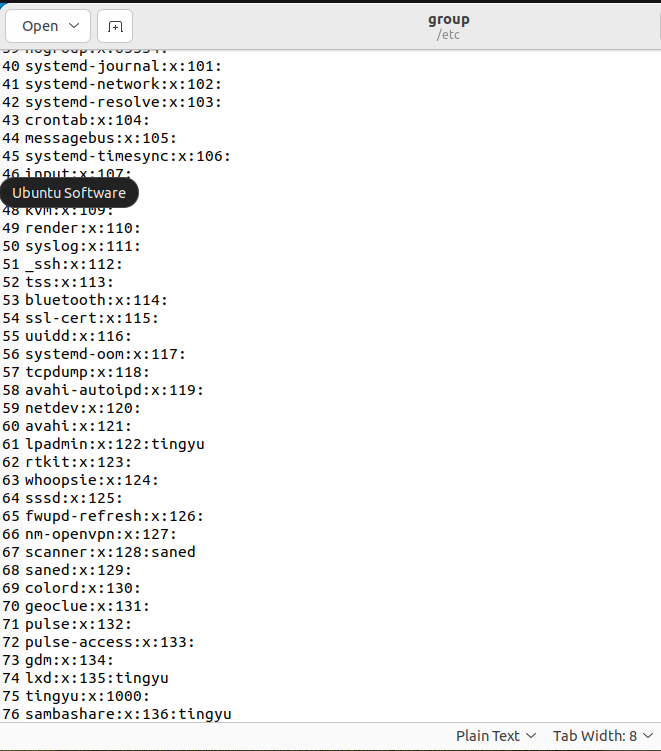

tingyu\:x:1000:


##### 3.文件权限

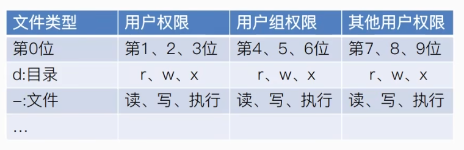

例如：
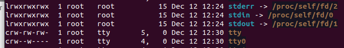


