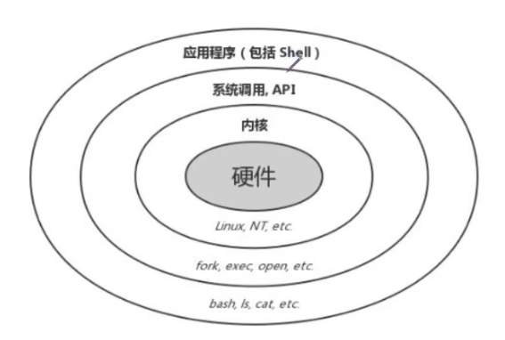
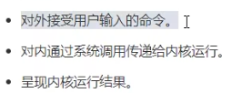
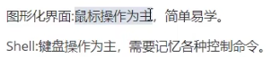
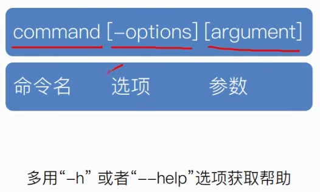
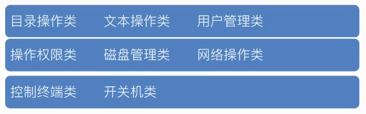
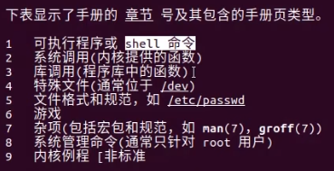
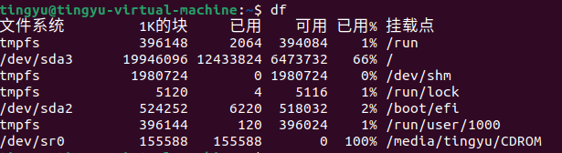
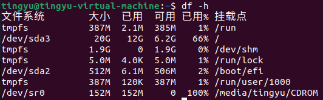
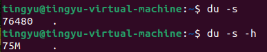

# 8-10.Linux命令行

##### 1.Shell是什么？



用户跟Linux内核所沟通的桥梁




###### Shell与图像化界面



##### 2.命令的格式与帮助



##### 3.常用命令

tips：

​	1.按Table键可以自动补全，若有多个结果按两下Table提示

​	2.!!可以执行上一次执行的命令/其实用向上方向键也可以，但一般用于权限不够时使用!!并添加sudo



###### 查询命令

man

```
man man
//查询man命令的使用手册
```

```
man printf
//查询printf命令的使用手册
```

```
man n printf
//查询第n章的printf的使用手册，n为数字
如若报错：No manual entry for printf in section 3
则需安装：sudo apt-get install manpages-posix-dev
```

章节介绍：



###### 目录操作类

```
cd
//查询cd使用：	man cd(详细)     或	cd --help(主要用法)
//进去某一路径里
//cd / 进入根目录		cd ~ 进入自己的主目录
//cd ..	返回上一级目录
```

```
pwd
//打印当前目录位置
```

```
ls
//查看当前目录的列表
例如：ls -a 查看当前目录所有列表(包括隐藏文件，即是以.开头的文件)
```

```
mkdir
//创建文件夹
mkdir imubuntu
```

```
rmdir
//删除文件夹(只有当文件夹为空时才能删除)
```

```
mv
//资源重命名或移动文件目录
例如：mv mywork/ youwork
```


###### 文本操作类

```
touch
//创建新文件
例如：touch imubuntu.txt
```

```
cat
//展示文件内容
例如：cat imubuntu.txt
```

```
gedit
//文本编辑器
例如：sudo gedit imubuntu.txt
```

```
echo
//往终端输出字符串
例如：echo 12345
例如：echo 12345 >> imubuntu.txt	追加到末尾
若为一个>，则为删除全部内容，重新填写
```

```
wc
//统计文本字符数
例如：wc hello.txt
输出：0  4 22 hello.txt
分别为：行数-l、单词数-w、字符数-c
```

```
rm
//删除文件	可删除含有文件的文件夹
```

```
ln
//创建链接：	硬链接/软链接
硬链接：
	ln 123.txt 456
软链接：
	ln -s 456 789
硬链接相当于值传递、副本
软链接相当于地址传递、快捷方式

ls -l	可以看到链接属性
```

```
cp
//复制
例如：cp 123.txt test	复制文件
例如：sudo cp -r ebf_dir/ ebf_dir_bak	复制路径
```

```
tar
//打包命令
归档（archive）命令。它的作用是将多个文件或目录打包成一个单独的文件（即归档文件），以便于管理和传输。压缩是一个独立的过程，tar 通常和压缩工具（如 gzip 或 bzip2）结合使用，以便不仅归档文件，还能压缩它们。
例如：tar -cf archive.tar file1 file2 file3
这个命令会将 file1、file2 和 file3 归档成一个 archive.tar 文件。
-c：创建一个新的归档文件。
-f：指定归档文件的名称。
```

```
find
//查找文件目录
例如：sudo find / -name "hello.txt"
```

```
grep
//从文本中找出我们需要的字符串
例如：grep "imstr" 123.txt -n
-n:输出文本行号
```

###### 用户管理类

```
sudo
//短暂获得root权限
```

```
su
//用户切换
例如：su tingyu
```

```
useradd/adduser
useradd:创建最简单最基础的用户
adduser:创建好基本的配置
```

```
usermod
//修改用户配置
例如:sudo usermod -g 1001 tingyu
修改tingyu的GID为1001
```

```
userdel/deluser
//删除用户，区别同add
例如：sudo deluser tingyu
```

```
passwd
//修改用户密码
例如:sudo passwd tingyu
```

```
groupadd/addgroup
//添加用户组，区别同add
例如：sudo addgroup tingyu
```

```
groupdel/delgroup
//删除用户组，区别同add
例如：sudo delgroup tingyu
```


###### 文件权限类

```
chmod
//修改用户权限
例如：sudo chmod 777 123.txt
注释:777对应111 111 111 即全部都可读可写可执行
```

```
chown
//修改文件拥有者
例如：sudo chown chuiyu 123.txt
注释：将123.txt的文件拥有者修改为chuiyu用户
```

```
chgrp
//修改文件用户组
例如：sudo chgrp chuiyu 123.txt
```


###### 磁盘管理类

```
df
//展示文件信息
例如：df
```



```
例如：df -h 		//改变容量的显示单位
```




```
du
//汇总一组文件的信息情况，若是汇总文件夹则以递归形式
例如：du -h
例如：du -s	//只输出磁盘使用的空间信息
```




```
mount
//把硬件/网络设备挂载到某一目录下
```

```
umount
//卸载文件系统
```


###### 网络操作类

```
ping
//测试链路连通性
```

```
ifconfig
//相当于ipconfig

1.修改ip
sudo ifconfig ens33 192.168.82.250

2.开启/关闭网卡
sudo ifconfig ens33 down
sudo ifconfig ens33 up
```


###### 控制终端类

```
clear
//清屏
```


###### 开关机命令

```
reboot
//重启命令
```

```
poweroff
//关系命令
```


