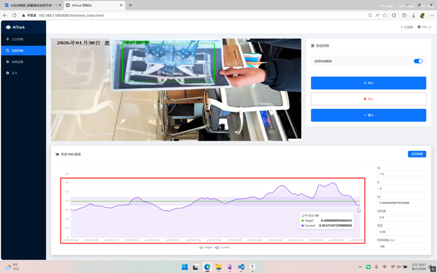

# 基于 RK3588 的码头门机抓斗智能视觉追踪系统

Git仓库链接：暂无

## 1. 项目概述
本项目是针对**工业港口码头**场景开发的嵌入式视觉系统，旨在解决门机作业中对**抓斗（Grab Bucket）**的实时定位与自动追踪难题。系统基于高性能嵌入式平台 **Rockchip RK3588**，深度整合了 **YOLOv11-OBB/HBB 目标检测**、**ByteTrack 多目标追踪**以及 **PID 云台控制**算法。

通过部署在门机前大梁上的云台相机，系统能够全天候自动识别抓斗位置、姿态，并控制云台进行平滑、稳定的实时跟踪，为港口自动化作业提供关键的视觉引导与状态监测能力。

## 2. 应用场景与痛点解决
*   **场景**：大型港口门座式起重机（门机），相机高空俯拍。
*   **痛点**：
    *   抓斗在作业过程中存在大幅度摇摆和旋转。
    *   工业现场环境复杂，存在遮挡干扰，容易丢失目标。
    *   嵌入式端算力受限，难以兼顾高帧率检测与低延迟控制。
*   **解决方案**：利用 YOLOv11-OBB/HBB 实现高精度旋转框检测，结合多线程 NPU 加速与 PID 闭环控制，实现“既看得准，又跟得稳”。

## 3. 核心技术架构

### 3.1 感知层：YOLOv11-OBB & NPU 加速
*   **旋转框检测**：针对抓斗的不规则旋转特性，采用 **YOLOv11-OBB (Oriented Bounding Box)** 模型，相比传统水平框，能更紧密地贴合抓斗边缘，显著提升定位精度。
*   **NPU 异构计算**：利用 RK3588 内置的 6TOPS NPU，通过 `rknn_api` 直接调用硬件加速。
*   **多线程并发**：设计了 **3-Worker 并行推理架构**，充分榨干 NPU 的 3 个核心，大幅提升系统吞吐量（FPS）。

### 3.2 调度层：帧同步与乱序重排
为了解决多线程推理导致的“结果返回乱序”问题（即后采集的帧先推理完成），设计了基于 **Frame ID** 的轻量级调度器。

*   **核心逻辑**：
    1.  **帧绑定**：采集时将图像与全局递增的 `frame_id` 绑定。
    2.  **局部排序**：主线程维护一个缓冲区，对 Worker 返回的乱序结果进行重排。
    3.  **追新补空**：优先处理最新帧；若中间出现丢帧，自动触发追踪器的预测模式（Predict Only）以保持算法状态连续。

### 3.3 追踪层：ByteTrack & 轨迹预测
*   **ByteTrack 算法**：采用关联匹配策略，有效处理抓斗被部分遮挡或短暂消失的情况，保证 ID 不跳变。
*   **OBB 适配**：实现了从旋转框（OBB）到追踪器所需格式的转换适配。
*   **轨迹平滑**：引入卡尔曼滤波（Kalman Filter）对抓斗运动轨迹进行平滑预测，减少检测抖动对控制系统的影响。

### 3.4 控制层：自适应 PID 云台控制
*   **双环 PID**：实现了 **PTZ（云台转动）** 和 **Zoom（变焦）** 的双重 PID 闭环控制。
*   **长焦优化**：设计了**速度自适应衰减算法**。当相机处于长焦（高倍率）状态时，自动降低云台转动速度，防止画面剧烈晃动，确保远距离追踪的稳定性。
*   **VISCA 协议**：通过 TCP 网络发送 VISCA 指令，直接驱动工业级云台相机。

## 4. 关键代码展示

以下代码展示了项目中核心的 **多线程乱序重排与调度逻辑**，这是保证系统低延迟与高可靠性的关键（摘自 `src/main.cpp`）：

```cpp
// 主循环：负责结果调度与 PID 控制逻辑
while (g_running)
{
    // 1. 获取所有 Worker 检测到的目标（可能乱序）
    std::vector<DetectedTarget> incoming_targets;
    {
        std::lock_guard<std::mutex> lock(g_target_mutex);
        if (!g_detected_targets.empty()) {
            incoming_targets = g_detected_targets;
            g_detected_targets.clear(); // 清空缓冲区
        }
    }

    // 2. 按 frame_id 分组进行局部排序
    // 使用 map 自动排序: frame_id -> targets
    std::map<uint64_t, std::vector<DetectedTarget>> batch_map;
    for (const auto& t : incoming_targets) {
        batch_map[t.frame_id].push_back(t);
    }

    // 3. 遍历处理排序后的数据
    for (auto& kv : batch_map) {
        uint64_t current_id = kv.first;
        std::vector<DetectedTarget>& targets = kv.second;

        // 初始化 last_processed_frame_id
        if (last_processed_frame_id == 0) {
            last_processed_frame_id = current_id - 1;
        }

        // 策略 A: 过期帧 (迟到了) -> 丢弃，保证实时性
        if (current_id <= last_processed_frame_id) {
            continue;
        }

        // 策略 B: 缺帧 (中间有空缺) -> 补空帧预测，维持 ByteTrack 状态
        // 例如 last=100, current=103, 则补 101, 102 的预测
        while (last_processed_frame_id + 1 < current_id) {
            last_processed_frame_id++;
            #ifdef ENABLE_BYTETRACK
            std::vector<Object> empty_objects;
            tracker.update(empty_objects); // 纯预测更新
            #endif
        }

        // 策略 C: 正常处理当前帧
        // ... (执行 ByteTrack 更新与 PID 控制) ...

        // 更新状态
        last_processed_frame_id = current_id;
    }
    
    // 控制循环频率
    std::this_thread::sleep_for(std::chrono::milliseconds(ptzController.get_ptz_control_interval()));
}
```

## 5. 系统功能与交互
*   **Web 管理后台**：基于 `httplib` 开发，支持参数热更新（PID系数、追踪灵敏度）、系统重启及状态监控。
*   **实时预览**：支持通过 WebSocket 推送 JPEG 流，或通过 UDP 协议向上位机推送带检测框的调试视频流。
*   **配置持久化**：支持 JSON 格式的配置文件读写，方便现场部署与调试。

## 6. 技术栈
*   **硬件平台**：Rockchip RK3588
*   **开发语言**：C++17
*   **AI 推理**：RKNPU2, YOLOv11-OBB
*   **算法库**：OpenCV, ByteTrack, Eigen
*   **网络/通信**：WebSocket++, TurboJPEG, VISCA over TCP
*   **开发环境**：Linux (Ubuntu), CMake, VSCode

## 7.相关截图

